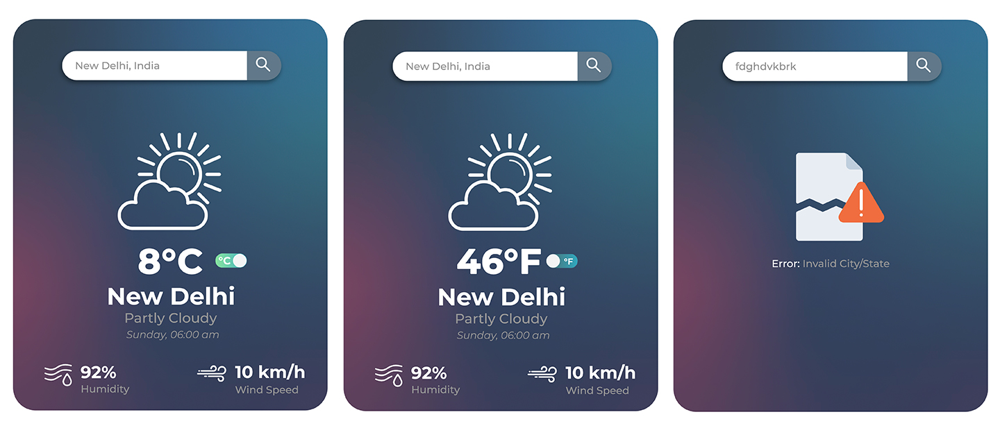

### Weather Forecast Widget

The candidate is tasked with creating a weather forecast widget using ReactJS, targeting modern
web browsers. The application must fetch and display real-time weather data for a specified city using
the [OpenWeatherMap API](https://openweathermap.org/api), including temperature, humidity, and general weather conditions. Users
should be able to input or select a city, toggle between Celsius and Fahrenheit, and view a
user-friendly interface that also handles error states effectively. While the core functionality
revolves around a single-screen layout featuring a city input field and a weather
widget, bonus points are awarded for additional features such as a 5-day forecast, a visually
appealing design with smooth transitions and animations, and robust error handling for edge cases
and connectivity issues. The project should emphasize clean, modular code, a clear separation of UI
and business logic, and the use of modern React Native methodologies. The provided Figma assets serve
as a design reference and are not required for replication. Upon completion, the candidate is expected
to publish the code in a public repository and can earn recognition for an innovative and responsive
user interface.

[View Figma Assets](https://www.figma.com/community/file/1268865175425298807)

## Successful Candidates

- Possess a sharp, analytical mind with a strong mental grasp of complex problems
- Engage deeply with intellectual challenges and exhibit comfort in complex problem-solving
- Efficiently manage, agree and prioritize multiple tasks and viewpoints concurrently
- Excel in autonomous work environments, operating effectively without direct supervision
- Understand and adhere to implicit standards and conventions in all work aspects
- Practice and embody the principle of meticulous attention to detail at all levels
- Consistently prioritize and deliver high-quality, scalable, and performant code
- Have an in-depth understanding of the processes their code influences and controls
- Strongly commit to rigorous testing and quality assurance to ensure product excellence
- Develop and implement comprehensive error handling and logging mechanisms
- Respect and value the perceptions of others in their deliverables and collaboration
- Manage time effectively to respect deadlines and deliver on their own commitments
- Skillfully design and develop respectful and user-friendly application interfaces (FE only)
- Perfectly understand major security threats and thus can build protected systems (BE only)
